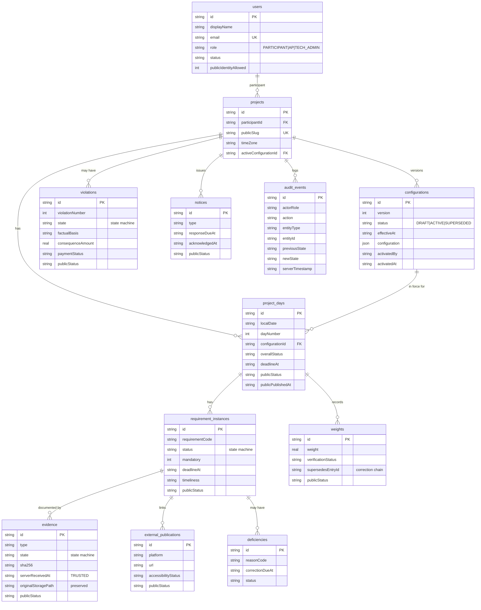

# Entity Relationship Diagram

Mirrors blueprint §11. In the reference these are SQLite tables; in a Firebase
deployment they map 1:1 to collections with the same field names.

## Notes

- **Publication state** (`publicStatus`) lives on every publishable entity so
  the public/private boundary is data, not code paths (§3.6).
- **Correction chains**: `weights.supersedesEntryId` preserves the original and
  the corrected value; the original row is never mutated (§7.9, §3.4).
- **Config binding**: `project_days.configurationId` freezes the rules a day was
  created under; activating a new configuration never rewrites prior days.
- **Trusted time**: `evidence.serverReceivedAt` and `requirement_instances`'
  computed `timeliness` are the authoritative timeliness inputs.
